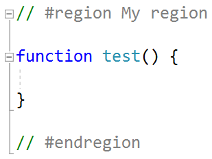
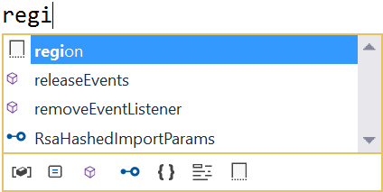
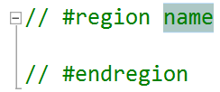

# JavaScript Regions

Download this extension from the [VS Marketplace](https://marketplace.visualstudio.com/items?itemName=MadsKristensen.JavaScriptRegions)
or get the [CI build](http://vsixgallery.com/extension/74208c70-24ae-4899-ac91-658f11f0e65b/).

---------------------------------------

Adds support for region comments in JavaScript and TypeScript files

See the [change log](CHANGELOG.md) for changes and road map.

## Features

- Region outlining/folding
- Snippet for inserting region

### Outlining
Creates collapsable regions in the JavaScript/TypeScript document.

Here's the same code collapsed:

### Snippet
A `region` snippet is provided in IntelliSense to make it easy to use regions in your code.

This will insert the region and place the cursor in the right location.

## Contribute
Check out the [contribution guidelines](.github/CONTRIBUTING.md)
if you want to contribute to this project.

For cloning and building this project yourself, make sure
to install the
[Extensibility Tools 2015](https://visualstudiogallery.msdn.microsoft.com/ab39a092-1343-46e2-b0f1-6a3f91155aa6)
extension for Visual Studio which enables some features
used by this project.

## License
[Apache 2.0](LICENSE)